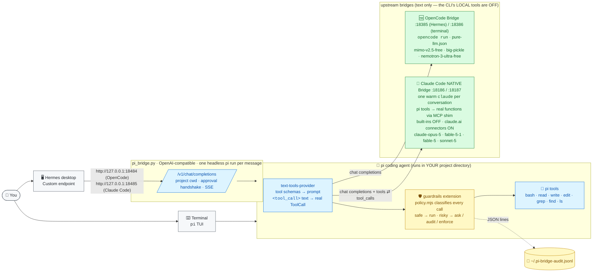

# 🥧 pi-agents — the [pi](https://github.com/earendil-works/pi-mono) coding agent as Hermes' executing agent

pi plans, calls the tools (`bash`, `read`, `write`, `edit`, `grep`, `find`, `ls`) and answers — behind an OpenAI-compatible bridge
Hermes talks to, and in your own terminal. Every tool call passes a **Codex-style guardrail**: safe read-only calls run, risky ones
wait for your approval (a 3-option prompt in the terminal, a `reply approve` handshake in Hermes). One policy engine drives every
backend; only the model behind pi changes.

## 🏗️ Architecture



Two of the folders skip Hermes entirely and put pi in your terminal instead — [`macos/claude-code/pi-cli`](macos/claude-code/pi-cli)
(Claude Code, native tool calls, `:18187`) and [`macos/pi-opencode-cli`](macos/pi-opencode-cli) (OpenCode free models, `:18386`).
Both register as ordinary pi providers, so they can be installed side by side and switched with `--provider` / `/model`.

**Read it left to right.** Hermes sends an ordinary chat completion to `pi_bridge.py`. The bridge runs pi headless in the project
directory Hermes named. pi's provider extension turns the model's text into tool calls; the guardrails extension decides whether each
call runs now, is held for your approval, or is blocked; pi executes it and loops. The model itself never touches your machine:
both upstream bridges run their CLI with its local tools disabled. The OpenCode bridge is text-only (pi's provider emulates tool
calls over text); the Claude Code bridge is **native** — pi's tools are exposed to Claude as real functions through an MCP shim and one
warm `claude` process serves the whole conversation — and it keeps Claude's **claude.ai connectors** (Atlassian/Jira, Confluence, …)
available, limited to a read-only allowlist, so SaaS look-ups happen inside Claude while every local command still goes through pi
and the guardrails.

The folders are organised by **OS → model backend**; the shared pieces live once in `macos/common/`.

| Folder | OS | Model backend | Ports (pi bridge / upstream) | Status |
|--------|----|---------------|------------------------------|--------|
| 🍎🆓 [`macos/opencode/`](macos/opencode) | macOS (Linux launcher included) | OpenCode **free** models via the pure-LLM OpenCode Bridge | `18484` / `18385` | ✅ verified end to end from Hermes |
| 🍎🤖 [`macos/claude-code/`](macos/claude-code) | macOS (Linux launcher included) | **Claude Code CLI, native tool calling** (MCP shim, one warm `claude` per conversation), built-ins off + read-only claude.ai connectors (Jira/Confluence) on: opus-5, fable-5-1, fable-5, sonnet-5 … on your Claude subscription | `18485` / `18186` | ✅ verified end to end |
| ⌨️🤖 [`macos/claude-code/pi-cli/`](macos/claude-code/pi-cli) | macOS | Terminal-native `pi` on Claude Code: pi's own tools as **real function calls**, **all** claude.ai connectors, no guardrails | `—` / `18187` | ✅ verified |
| ⌨️🆓 [`macos/pi-opencode-cli/`](macos/pi-opencode-cli) | macOS (Linux service included) | Terminal-native `pi` on OpenCode **free** models (pure-LLM bridge, tool calls emulated over text), guardrails opt-in | `—` / `18386` | ✅ verified |
| 🧩 [`macos/common/`](macos/common) | | Shared: `pi_bridge.py`, provider + guardrails extensions, launcher & installer libraries | | |
| 🍎🧠 `macos/codex/` | macOS | OpenAI Codex CLI / GPT models behind pi | | 🚧 planned |
| 🐧 `linux/…`, 🪟 `windows/…` | | | | 🗺️ later |

## 🚀 Start here

Pick a backend and run its installer — it makes the setup persistent (auto-start user services) and runs a live test:

```bash
cd ~/hermes-claude-code-bridge/pi-agents/macos/opencode && ./install.sh
```

```bash
cd ~/hermes-claude-code-bridge/pi-agents/macos/claude-code && ./install.sh
```

Both can run side by side; in Hermes each is its own custom endpoint (`:18484` and `:18485`) — switch with **Use**. Details,
prerequisites and Hermes settings are in each backend's README.

## 🛡️ What "guardrails" means here

- **Classify, then decide.** `common/extensions/guardrails/policy.mjs` looks at every tool call before it runs. With the default
  `profile: "dangerous-only"` everyday work runs silently (`mkdir`, `cp`, edits in the project, `git commit`, `npm install`,
  `kubectl get`, `terraform plan`, `docker run` …) and only **destructive, irreversible, privileged or secret-exposing** calls are
  risky: `rm -rf`, `sudo`, disk/service changes, `kubectl apply/delete`, `helm upgrade`, `terraform apply/destroy`, cloud
  create/delete/terminate, `git push` / `reset --hard` / `clean`, `gh pr merge`, `docker prune`, `curl | sh`, secret retrieval,
  writes to system paths, nested AI CLIs. `profile: "read-only"` is the strict alternative (anything that mutates is risky).
- **Three modes** per backend in `guardrails.json`: `ask` (default) → 3-option prompt in the terminal / `reply approve` in Hermes;
  `audit` → run everything, log what *would* have asked; `enforce` → block risky calls outright.
- **Audit trail:** every decision is a JSON line in `~/.pi-bridge-audit.jsonl`.
- **Same policy everywhere:** the pi extension, both Hermes bridges and the optional OpenCode plugin import the same engine;
  `node macos/common/extensions/guardrails/selfcheck.mjs` runs ~300 allow/block cases offline across both profiles.

## 🧭 Adding a backend

Create `macos/<backend>/` with a `run-bridge.sh` that sets `BACKEND_NAME`, ports, labels, `PROVIDER_ID`, `MODEL`, defines
`upstream_run` (start the backend's CLI bridge in pure-LLM mode) and sources `../common/launcher.sh`; an `install.sh` that defines
`backend_install_deps` and sources `../common/install-lib.sh`; a `guardrails.json`; a `.env.example`; and a README with the same
📦 / ✅ / 🚀 / 🖥️ / 🛡️ / 🩺 sections. `macos/claude-code/` is the template — about 60 lines of shell on top of `common/`.
